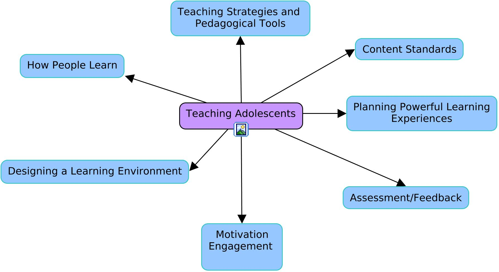

# EDU 3024/5374 - **Teaching Methods and Curriculum in Grades 7-12** (Asynchronous)

## Course Instructor

**Instructor:** Dr. Gerald Ardito                                  **Semester** Fall 2022

**Email:** [gerald.ardito@mville.edu](mailto:gerald.ardito@mville.edu)                            **Faculty Phone Number:** (914) 323-1254

**Office Hours:** T/W 4-5:30                                        **Chair:** Dr. Victoria Fantozzi

and by appointment.

## Course Description

This course will explore curriculum approaches, teaching and assessment strategies, classroom management, and other critical issues in teaching at the middle childhood and adolescence levels. Students will become familiar with the ways in which middle and high schools function, both within their buildings and within their broader communities. Essentially we will be trying to answer a very complicated question: How can teachers behave in the classroom to make it more likely that their students will learn? In fact, that will be the essay question for your final exam.

## Essential Questions and Enduring Understandings

### Essential Questions

This course is designed around these Essential Questions:

1. How can we design and orchestrate learning activities for adolescents that foster and promote deep learning?

2. What does it mean to orchestrate levels of complexity and abstraction in learning activities?

3. How can we create and maintain autonomy supportive learning environments for adolescents?

### Big Ideas/Enduring Understandings

This course is designed around these Big Ideas/Enduring Understandings:

1. Adolescent students are engaged and by learning environments that foster and support autonomy, competence, and relatedness.

2. Curriculum design is all about orchestrating learning activities that skillfully move between levels of complexity and abstraction.

3. How can we create and maintain autonomy supportive learning environments for adolescents?

## Required Texts

There are two textbooks for this course.

1. Lombardi, Paula (n.d.). [Instructional Methods, Strategies and Technologies to Meet the Needs of All Learners](https://drive.google.com/file/d/1ZlrNdlDBAtPn-WXWWzNFUKLIvSADWXAq/view?usp=sharing). The title links to a pdf version of the book.

2. Wiggins, G. & McTighe, J. & . (2005) [Understanding by Design](https://drive.google.com/file/d/1wqr7PVwq3Squ_kvP_-qW3bbnXeiA5tdI/view?usp=sharing). ASCD. The title links to a pdf version of the book.

Other course readings will be provided by the instructor.

## Course Resources

Here are links to resources you will need for this course.

[Course Syllabus](https://www.dropbox.com/s/62ok0dc56iuh8gg/Ardito%20EDU%203024%205374%20Fall%202022%20SyllabusV1.pdf?dl=0). Here you will find the latest version of the course syllabus.

[Course Readings](https://drive.google.com/drive/folders/1ahBk3Ih7O43cJ_QyGE7ceDc7u1Dxlf4R?usp=sharing). Here you will find any readings assigned for this course.

[Course Presentations](https://drive.google.com/drive/folders/1TQo9fhyQiHZK6I_SekGwyGA44IZPKFAE?usp=sharing). Here you will find any presentations I develop for the course.

[Fieldwork Resources](https://drive.google.com/drive/folders/1EQVUNAuYQMNPEjEJTjHzXSa7QsIM35VC?usp=sharing). Here you will find logs and other materials for the 18 hours of fieldwork requirement for this course.

[Course Rubrics](https://drive.google.com/drive/folders/1gBN8l2nAaX5aA-RpxNSN8JMlKbV6apcY?usp=sharing). Here you will find the rubrics for the routine learning activities you will be doing.

[Planning Templates](https://drive.google.com/drive/folders/1m9B4CeAvXPHawj3diuwWXNjgmrXqJpHC?usp=sharing). Here you will find the templates we will be using to create unit and lesson plans and other assorted goodies.

## Course Structure

### Course Topics

This course is organized around these ***topics***.

### Course Excursions

These topics are organized into a set of what I call ***Excursions***.

#### Excursion 1: Setting the Table
In this excursion, we will lay the groundwork for our working together this semester. We will introduce ourselves to some of the key concepts of the course and establish the basics of our work together (class discussions, reading/viewing/observing journals, interacting with one another).

#### Excursion 2: Learning Environment, Learning Experiences, and Deep Learning
In this excursion, we will explore the characteristics of learning environments and their design  that support, promote, and foster deep learning, as well as how learning works. In this excursion, we will also explore the phenomena of engagement and motivation.

#### Excursion 3: Orchestrating Complexity, Abstraction, and Depth in Learning Activities
In this excursion, we will explore the various strategies, methods, and technologies for orchestrating complexity, abstraction, and depth in learning activities, with a focus on student-centered curriculum design.

#### Excursion 4: Putting Theory into Practice: Designing Powerful Learning Experiences
In this excursion, put into practice what we have learned about learning environments, engagement & motivation, and orchestrating complexity, abstraction, and depth through the design of full unit and lesson planning.

#### Excursion 5: Who Are We Now as Teachers of Adolescents
In this (last) excursion, you will reflect on your journey in this course, with a particular focus on building connections across our various excursions.

### Key Assignments

Here are the key assignments for this course.

#### Attendance and Participation (10%)
Students are expected to be an active participant in the course, demonstrated through completing each week’s assignments with high quality, and by interacting frequently and substantively with your classmates. 

#### Reading/Viewing/Reflective Journals (20%)
Students are expected to write journal entries each week in response to texts of various kinds (journal articles, videos, podcasts, etc.). I will post the requirements and rubric for this assignment.

#### Fieldwork Components (20%)
Each student is to spend 18 hours observing middle school or high school classes for this course.  When completed you will write a 5 page double spaced reflection of your visits.  You should to focus on teaching and learning and make connections with all the readings as you observe middle school or high school classes or attend meetings. The field experience summary log will be submitted to the professor on the last day of class for the semester. Most observations must be in secondary classes. Some tutoring, interviews, and education meetings are also acceptable for hours, but no more than 25 percent of the total time All field observations are a key part of connecting the readings and our discussions to what you observe. 

The four questions you are to consider for every classroom observation are: What is the teacher doing? What are the students doing? Were the students learning? How do you know this is true?

Students must complete the 18 hours of observations and 5-page write-up by the last class, or they will receive a failure for the course.

#### Unit Plan/Lesson Plan Sequence/Mini Lessons (30%)
Each student will create a full unit plan and then a lesson plan sequence for a topic within their content area using the Manhattanville Planning Templates.

#### Final Essay Exam (20%)
In a double-spaced typed paper of 7 to 8 pages, explain: How can teachers behave in the classroom to make it more likely that their students will learn? Synthesize your reading, class experiences, and field component as you make sense of how you would make it more likely that students in your class will learn. The Final Essay is due in WEEK 14. You are asked to cite each of a substantial number of class readings, refer to our class discussions and your fieldwork experiences, and conclude with a statement of personal philosophy that is at least one page in length.

## Course Rhythms

### Course Schedule

Here is how we will be working together during this course.

This is an *asynchronous course* which in which the week goes from **Tuesday to Monday**. New work will be posted each Tuesday to be completed by the following Monday.

### Mattermost

[Mattermost](https://mattermost.com) is a team-based chat tool similar to Slack and Discord. This will be our **communications hub** for this course. Among its many features is the availability of apps for your computers and mobile devices. Once you set these up, you will receive notifications of activity just like in other communication tools you likely use.

On Mattermost you will be able to communicate with one another through *channels* (there will be channels for each week's work and for each week's Guiding Questions, for example) as well as through *direct messages*. I will be posting each week's assignments to Mattermost in its own channel.

Here is a quick tutorial to help you get started with Mattermost.

Course Site

Course Schedule